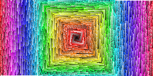
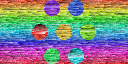

# Code challenge @ Education Horizons Group
## Use 32*32*32 discrete colours in RGB format to produce a image, build and deploy using React

- Version 1

- Version 2

## Website 👉 [https://13.239.120.30:3000](https://13.239.120.30:3000)
### *created by CRA*